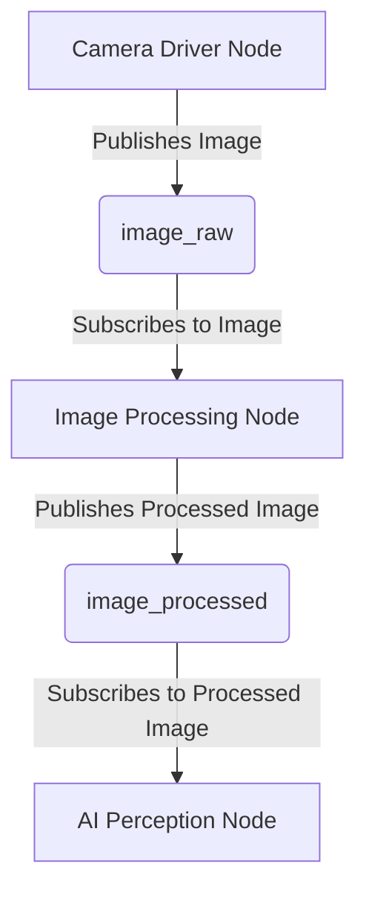

# ROS 2 Architecture

The Robotic Operating System 2 (ROS 2) serves as the "nervous system" for our physical AI systems, providing a flexible framework for communication, coordination, and control of diverse hardware and software components. It's an open-source middleware designed for robotics applications, enabling modular development and reuse of code.

## Core Concepts

### 1. Nodes

-   **Definition**: Nodes are individual processes that perform specific tasks. Each node is a standalone executable program within the ROS 2 graph.
-   **Example**: A camera driver node, a motor control node, a navigation algorithm node.
-   **Benefit**: Modularity. Nodes can be developed, tested, and run independently, improving system robustness and maintainability.

### 2. Topics

-   **Definition**: Topics are named buses over which nodes exchange messages. It's a publish/subscribe communication model.
-   **Publishers**: Nodes that send messages to a topic.
-   **Subscribers**: Nodes that receive messages from a topic.
-   **Messages**: Data structures that topics transport. ROS 2 provides standard message types (e.g., `sensor_msgs/msg/Image`, `geometry_msgs/msg/Twist`) and allows custom message definitions.
-   **Example**: A camera node publishes images to `/camera/image_raw`. An image processing node subscribes to `/camera/image_raw` and publishes processed images to `/camera/image_processed`.

### 3. Services

-   **Definition**: Services enable synchronous request/reply communication between nodes. A client node sends a request to a service server node and waits for a response.
-   **Example**: A client node requests a robot to "take a picture." A service server node on the robot performs the action and returns a "picture taken" status.
-   **Benefit**: Useful for operations that require a single result and confirm completion.

### 4. Actions

-   **Definition**: Actions are used for long-running, goal-oriented tasks that provide periodic feedback and can be preempted. They extend the service concept by allowing feedback during execution and cancelation.
-   **Components**: Goal (request), Feedback (progress updates), Result (final outcome).
-   **Example**: A client node requests a robot to "navigate to position X." The navigation action server provides feedback on current progress (e.g., "robot is 50% there") and returns "goal reached" or "failed" as a result. The client can also cancel the navigation mid-way.

### 5. Parameters

-   **Definition**: Parameters allow nodes to configure their behavior at runtime without recompiling. They are dynamic values stored in a parameter server and can be accessed or modified by nodes.
-   **Example**: A navigation node might have a `max_speed` parameter that can be adjusted dynamically.

### 6. ROS 2 Graph

-   **Definition**: The runtime computational graph of ROS 2, showing how all nodes, topics, services, and actions are interconnected. Tools like `rqt_graph` can visualize this.

## Data Distribution Service (DDS)

Underneath ROS 2's communication layer is the Data Distribution Service (DDS). DDS is a vendor-neutral, open standard for real-time, high-performance, and scalable data exchange. ROS 2 leverages DDS for its discovery, serialization, and transport mechanisms. This allows for:

-   **Decentralized Architecture**: No central master node, improving fault tolerance.
-   **Quality of Service (QoS)**: Configurable parameters for reliability, latency, and durability of message delivery.
-   **Performance**: Efficient data transfer optimized for real-time systems.

## Conclusion

ROS 2 provides a robust and flexible foundation for building complex robotics applications. Its modular architecture, diverse communication patterns, and underlying DDS implementation are key to managing the complexity of Physical AI systems. The next chapter will explore how to interact with this architecture using Python (`rclpy`).

## Further Reading

-   [ROS 2 Documentation](https://docs.ros.org/en/humble/index.html)
-   [DDS Specification](https://www.omg.org/spec/DDS/About-DDS/)
