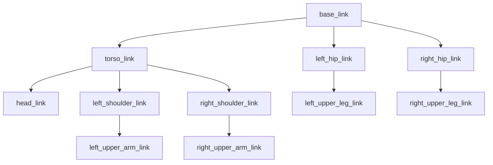

# URDF for Humanoid Robots

The Unified Robot Description Format (URDF) is an XML-based file format used in ROS to describe all aspects of a robot. This includes its kinematic and dynamic properties, visual appearance, and collision models. For humanoid robots, URDF is crucial for defining complex linkages, joints, and the overall physical structure in a way that simulation environments and motion planning algorithms can understand.

## Anatomy of a URDF File

A URDF file is composed of two primary elements: `link` and `joint`.

### 1. Link

-   **Definition**: A `link` represents a rigid body segment of the robot (e.g., torso, upper arm, hand).
-   **Properties**:
    -   `visual`: Describes the visual properties (e.g., geometry, color) for rendering in simulators like RViz or Gazebo.
    -   `collision`: Defines the geometry used for collision detection. Often simpler than the visual geometry for computational efficiency.
    -   `inertial`: Specifies the mass, center of mass, and inertia tensor. Essential for physics simulation.

```xml
<link name="base_link">
  <visual>
    <geometry>
      <cylinder length="0.6" radius="0.2"/>
    </geometry>
    <material name="blue">
      <color rgba="0 0 0.8 1"/>
    </material>
  </visual>
  <collision>
    <geometry>
      <cylinder length="0.6" radius="0.2"/>
    </geometry>
  </collision>
  <inertial>
    <mass value="10"/>
    <origin xyz="0 0 0.3"/>
    <inertia ixx="1.0" ixy="0.0" ixz="0.0" iyy="1.0" iyz="0.0" izz="1.0"/>
  </inertial>
</link>
```

### 2. Joint

-   **Definition**: A `joint` describes the connection between two links, defining their relative motion.
-   **Properties**:
    -   `parent` and `child`: Specify the two links connected by the joint.
    -   `type`: Defines the kind of motion (e.g., `revolute` for rotation, `prismatic` for linear, `fixed` for no motion).
    -   `origin`: Specifies the transform from the parent link's frame to the joint's frame.
    -   `axis`: For revolute and prismatic joints, defines the axis of rotation or translation.
    -   `limit`: Sets the upper and lower bounds of motion, velocity, and effort.

```xml
<joint name="base_to_torso" type="revolute">
  <parent link="base_link"/>
  <child link="torso_link"/>
  <origin xyz="0 0 0.6" rpy="0 0 0"/>
  <axis xyz="0 0 1"/>
  <limit lower="-1.57" upper="1.57" effort="100" velocity="0.5"/>
</joint>
```

## Humanoid Robot Structure in URDF

Defining a humanoid robot in URDF involves a hierarchical tree-like structure, starting from a base link (often the torso or hip) and branching out to limbs, hands, and head.



Each connection (`-->`) represents a joint, and each box (`[]`) represents a link. This tree structure is crucial for forward and inverse kinematics calculations.

## Xacro: Simplifying URDF

Writing complex URDF files, especially for humanoids, can be tedious and error-prone due to repetition. Xacro (XML Macros) is an XML macro language that allows for more concise and readable robot descriptions. It enables:

-   **Macros**: Define reusable blocks of URDF elements.
-   **Properties**: Define variables (e.g., link dimensions, joint limits) once and reuse them.
-   **Mathematics**: Perform simple mathematical operations within the file.

```xml
<!-- Example of Xacro usage for a simple cylinder link -->
<property name="body_mass" value="10"/>
<property name="body_radius" value="0.2"/>
<property name="body_length" value="0.6"/>

<macro name="simple_cylinder_link" params="name">
  <link name="${name}">
    <visual>
      <geometry>
        <cylinder length="${body_length}" radius="${body_radius}"/>
      </geometry>
    </visual>
    <inertial>
      <mass value="${body_mass}"/>
      <origin xyz="0 0 ${body_length/2}"/>
      <inertia ixx="${(1/12)*body_mass*(3*body_radius*body_radius + body_length*body_length)}"
               ixy="0.0" ixz="0.0"
               iyy="${(1/12)*body_mass*(3*body_radius*body_radius + body_length*body_length)}"
               iyz="0.0"
               izz="${(1/2)*body_mass*body_radius*body_radius}"/>
    </inertial>
  </link>
</macro>

<simple_cylinder_link name="base_link"/>
```

## Conclusion

URDF and Xacro are fundamental tools for defining the physical characteristics of robots within the ROS ecosystem. A well-defined URDF is essential for accurate simulation, motion planning, and control of humanoid robots. The next chapter will explore how these descriptions come to life in a physics simulator like Gazebo.

## Further Reading

-   [URDF Documentation](http://wiki.ros.org/urdf)
-   [Xacro Documentation](http://wiki.ros.org/xacro)
-   [ROS 2 Tutorials: Building a robot](https://docs.ros.org/en/humble/Tutorials/URDF/URDF-C++-tutorial.html)
