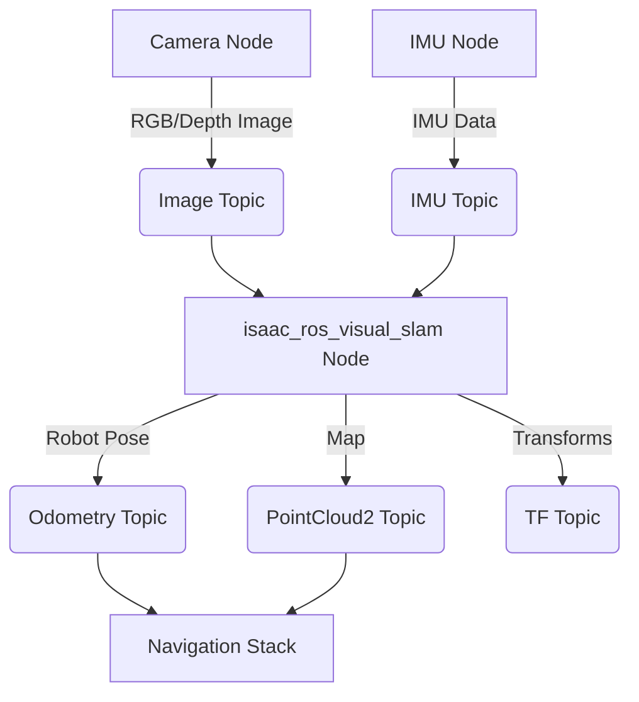

# Isaac ROS and VSLAM

**NVIDIA Isaac ROS** is a collection of GPU-accelerated ROS 2 packages that simplify the development and deployment of AI-enabled robots. It provides highly optimized components for perception, navigation, and manipulation, designed to run efficiently on NVIDIA hardware. A core component for autonomous robots is **VSLAM (Visual Simultaneous Localization and Mapping)**, which allows a robot to build a map of its environment while simultaneously tracking its own pose within that map using visual data.

## What is Isaac ROS?

Isaac ROS is built on top of ROS 2 and leverages NVIDIA's GPU technology to accelerate common robotics algorithms. Key features include:

-   **GPU-Accelerated Primitives**: Optimized modules for tasks like image processing, point cloud processing, and deep learning inference.
-   **Deep Integration with Isaac Sim**: Seamless transfer of perception models trained with synthetic data to real-world robots.
-   **Modular & Extensible**: A rich set of nodes and libraries that can be combined and extended to build complex robotics applications.
-   **Hardware Optimization**: Designed to run efficiently on NVIDIA Jetson platforms and other NVIDIA GPUs.

## VSLAM with Isaac ROS

VSLAM is a critical capability for any mobile or manipulatory robot that needs to operate autonomously in unknown or dynamic environments. It addresses two fundamental questions simultaneously: "Where am I?" (Localization) and "What does the environment look like?" (Mapping).

### How VSLAM Works

1.  **Visual Odometry (VO)**: Estimates the robot's motion by tracking features across successive camera images.
2.  **Mapping**: Builds a representation of the environment, often as a point cloud or a 3D mesh, using the visual data.
3.  **Loop Closure**: Detects when the robot returns to a previously visited location. This is crucial for correcting accumulated errors in VO and creating globally consistent maps.
4.  **Optimization**: Uses techniques like graph optimization to refine the map and trajectory, minimizing errors.

### Isaac ROS VSLAM Components

Isaac ROS provides highly optimized VSLAM solutions, often leveraging deep learning for feature extraction and matching.

-   **`isaac_ros_visual_slam`**: A package containing nodes for various VSLAM algorithms. It takes camera images (e.g., RGB-D, stereo) and IMU data, and outputs the robot's pose, a point cloud map, and other relevant information.
    -   **Inputs**: `sensor_msgs/msg/Image` (for RGB or depth), `sensor_msgs/msg/Imu`
    -   **Outputs**: `nav_msgs/msg/Odometry` (robot pose), `sensor_msgs/msg/PointCloud2` (map), `tf2_msgs/msg/TFMessage` (transformations).

### Nav2 Integration

Isaac ROS VSLAM integrates seamlessly with **Nav2**, the ROS 2 navigation stack. Nav2 provides capabilities for global and local path planning, obstacle avoidance, and executive control. VSLAM's output (accurate pose estimation and a map) serves as the primary input for Nav2's localization and planning modules.

A typical workflow would involve:
1.  **VSLAM** providing a consistent map and accurate localization.
2.  **Nav2's `AMCL` (Adaptive Monte Carlo Localization)** or a similar localization module using the VSLAM map to refine the robot's position.
3.  **Nav2's `Global Planner`** generating a path from the robot's current location to a desired goal.
4.  **Nav2's `Local Planner`** executing the path while avoiding dynamic obstacles.

## Sim-to-Real Techniques

A key advantage of using Isaac ROS and Isaac Sim together is the streamlined **sim-to-real** workflow. Perception models trained in Isaac Sim using synthetic data can be directly deployed to real robots running Isaac ROS, often with minimal fine-tuning.

### Domain Randomization

As discussed in the previous chapter, domain randomization (varying non-essential aspects of the simulation environment) helps train models that generalize well to the diverse conditions of the real world. Isaac Sim enables this by randomizing lighting, textures, object placements, and sensor noise.

### Physics-Based Simulators

Using physically accurate simulators like Isaac Sim ensures that the interactions and dynamics learned in simulation are representative of the real world, further improving sim-to-real transfer.

## Conclusion

Isaac ROS provides essential GPU-accelerated tools for building advanced AI-powered robots, with VSLAM being a cornerstone technology for autonomous navigation. Its deep integration with Isaac Sim and Nav2 creates a powerful and efficient development pipeline for Physical AI systems, simplifying the crucial step of sim-to-real transfer.

## Further Reading

-   [NVIDIA Isaac ROS Documentation](https://developer.nvidia.com/isaac-ros)
-   [Isaac ROS Visual SLAM](https://nvidia-isaac-ros.github.io/documents/isaac_ros_visual_slam/isaac_ros_visual_slam.html)
-   [ROS 2 Navigation Stack (Nav2)](https://navigation.ros.org/)
